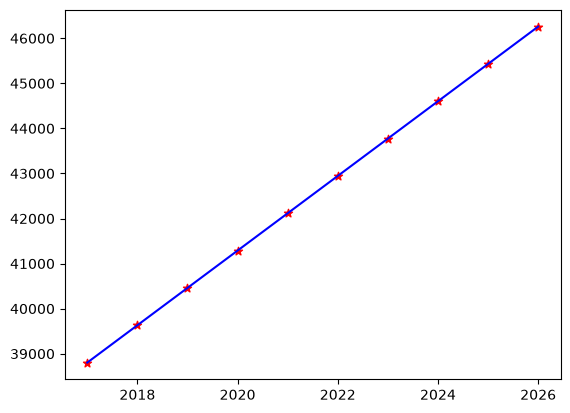

# Canada Per Capita Income Prediction using Linear Regression

A beginner Machine Learning project that predicts Canada's future per capita income using **Simple Linear Regression** with **scikit-learn**.

This project explores the historical trend of Canada's per capita income and uses a linear regression model to estimate future income values based on the year.

---

##  Project Overview

The objective of this project is to understand how Simple Linear Regression can be applied to time-series-like numerical data to identify trends and make future predictions.

Using historical per capita income data, the model learns the relationship between **Year** and **Per Capita Income (US$)** and predicts income for future years.

---

##  Dataset

The dataset contains two columns:

| Column                    | Description                              |
| ------------------------- | ---------------------------------------- |
| `year`                    | Year of observation                      |
| `per capita income (US$)` | Canada's per capita income in US dollars |

Additional files:
* `predcited_income.csv` – Model predictions for future years.

---

##  Machine Learning Workflow

* Load and explore the dataset using Pandas
* Visualize historical income trends
* Train a Simple Linear Regression model
* Predict per capita income for future years
* Export predictions to a CSV file
* Visualize the regression line along with future predictions

---

##  Output

The graph below shows:

* Historical per capita income data
* Best-fit regression line
* Predicted income values for future years

```markdown

```

---

##  Technologies Used

* Python
* Pandas
* NumPy
* Matplotlib
* Scikit-learn
* Jupyter Notebook

---

## How to Run

Clone the repository:

```bash
git clone <repository-url>
cd 01-Linear-Regression/02-Canada-Per-Capita-Income
```

Install the required packages:

```bash
pip install -r requirements.txt
```

Launch Jupyter Notebook:

```bash
jupyter notebook
```

Run all notebook cells to train the model and generate predictions.

---

##  Results

The trained model successfully learns the upward trend in Canada's historical per capita income and predicts future values based on the fitted regression line.

The generated predictions are saved as:

```text
predicted_income.csv
```

---

## Learning Outcomes

Through this project I learned:

* Applying Simple Linear Regression to real-world data
* Working with time-based numerical datasets
* Visualizing trends using Matplotlib
* Generating predictions for unseen data
* Exporting prediction results using Pandas
* Organizing a machine learning project for GitHub

---

##  Future Improvements

* Evaluate model performance using metrics such as R² Score.
* Compare Linear Regression with Polynomial Regression for long-term forecasting.
* Build an interactive web application using Streamlit to visualize predictions.
* Experiment with additional economic indicators to improve prediction accuracy.
